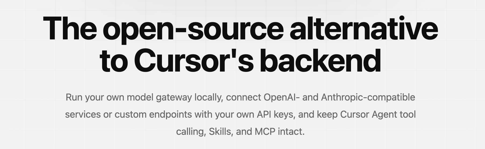

<div align="center">

# 青云currsor小助手

青云currsor小助手是一个运行在本机的 Cursor 模型网关，帮助你在 Cursor 中使用自己配置的模型服务。

本应用基于 CursorOK 助手二改。推荐使用青云聚汇中转站：https://api.qinggekeji.top

使用教程：https://qingdi1.github.io/QY-CursorOK/

</div>




## 项目简介

青云currsor小助手是一个本地模型网关。它在你的设备上运行服务，接收 Cursor 发出的 Agent 请求，将请求转发到你配置的模型服务，并尽可能保留 Cursor Agent 的工具调用、Skills、MCP 和多轮对话能力。

本应用基于 CursorOK 助手二改。推荐使用青云聚汇中转站：https://api.qinggekeji.top

你可以连接兼容 OpenAI 或 Anthropic 协议的服务，自定义服务地址、模型 ID、API Key 和请求参数，也可以使用 Cursor 平台默认选项之外的模型通道。

> [!IMPORTANT]
> 青云currsor小助手可免费使用，但你连接的模型服务商可能会按用量收费。本项目是独立项目，与 Cursor 或其开发者没有关联，也未获得其认可。

## 主要功能

- **自定义模型通道**：配置自己的 API 地址、凭据和模型 ID。
- **多种 API 协议**：支持 OpenAI Responses API、OpenAI Chat Completions API 和 Anthropic Messages API 兼容服务。
- **模型管理**：添加、复制、编辑、排序模型配置，并批量测试连接。
- **连接性能测试**：查看首字延迟、生成速度、总耗时和原始服务商响应。
- **Agent 工作流**：继续使用工具调用、Skills、MCP 和多轮对话。
- **会话指标**：查看 Token 用量、缓存命中率、对话轮次和估算价值。
- **TAB 补全服务**：在官方直连和自定义服务之间选择连接方式。
- **跨平台运行**：支持 macOS、Windows 和 Linux。

## 快速开始

1. 构建适合你操作系统的桌面应用。
2. 启动青云currsor小助手，打开 **Cursor 配置**，按提示初始化本地 CA（证书颁发机构）。
3. 在模型设置中添加模型，填写服务地址、API Key 和模型名称，然后保存并运行 **测试**。
4. 确认测试通过后，保持青云currsor小助手运行。
5. **首次升级 Cursor 或首次配置模型后，完全退出并重新启动 Cursor，然后新开一个对话**。在模型列表中选择已配置的模型，开始使用 Agent。

> [!TIP]
> 首次升级 Cursor 或首次完成配置后，必须完全退出并重新启动 Cursor，再新开一个对话。配置前已经打开的对话不会加载新连接；使用自定义模型时，请在模型列表中手动选择该模型，不要选择 **Auto**。

## TAB 补全服务

Cursor 的 Tab 补全由独立的 TAB 服务处理，不经过模型通道。你可以在 **系统设置 → TAB 设置** 中选择以下模式：

- **直连（默认）**：直接连接当前 Cursor 账号对应的官方 TAB 服务。
- **自定义**：自行部署 TAB 服务，然后填写 TAB 服务地址。

## 本地开发

```bash
npm --prefix apps/desktop install
make check
make build-desktop
```

## 许可证

本项目采用 [MIT License](./LICENSE) 开源。
